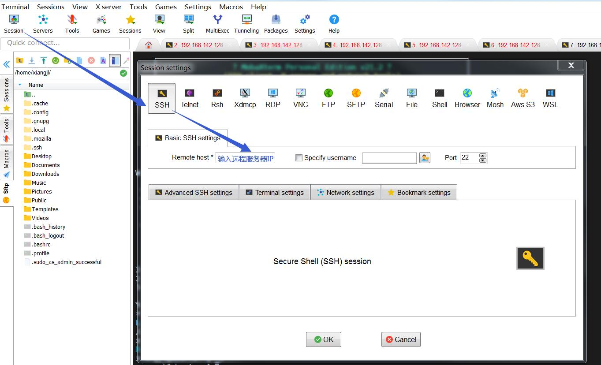
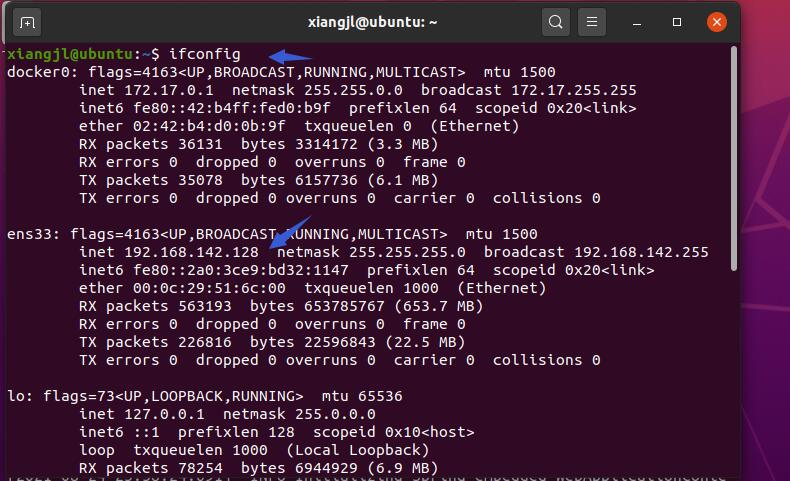

# 1、Linux基本操作

## 1.1 安装虚拟机

1.1.1 安装VMVare（获取其他虚拟机软件）

1.1.2 安装Linux版本

共享路径：\\xxzx\tools\操作系统\LINUX\UBUNTU\20.04

## 1.2 使用MobaXterm

ModaXterm是一款功能比较强大的终端软件。




**踩坑1：虚拟机的IP，新人容易取错**



**踩坑2：工具连接不上虚拟机**

虚拟机上运行

```
ssh localhost
```

报错

```
ssh connect to host localhost port22: Connection refused.
```

查看SSH安装情况

```
ps -e|grep ssh
```

如没有sshd则表示没有安装ssh服务器端，需要安装

```
sudo apt-get install openssh-server
```

安装完，可以再次检查安装是否成功。

# Docker讲解

https://docs.docker.com/engine/install/ubuntu/

## 1、安装

如果已经安装老版本的Docker，需要先卸载

```
sudo apt-get remove docker docker-engine docker.io containerd runc
```

安装依赖包

```
sudo apt install apt-transport-https ca-certificates curl gnupg-agent software-properties-common -y
```

导入源仓库的 GPG key

```
sudo wget https://download.docker.com/linux/ubuntu/gpg
sudo apt-key add gpg
```

添加Docker APT 软件源

```
sudo add-apt-repository "deb [arch=amd64] https://download.docker.com/linux/ubuntu $(lsb_release -cs) stable"
```

安装Docker 最新版本

```
sudo apt install docker-ce docker-ce-cli containerd.io -y
```

查看Docker是否启动成功

```
sudo systemctl status docker
```

## 2、拉取镜像

\# 拉取mysql

```
sudo docker pull mysql:latest
```

\# 拉取redis

```
sudo docker pull redis:latest
```

## 3、查看镜像

```
sudo docker images
```

## 4、运行容器

\# 运行mysql

```
sudo docker run -d \
--name mysql \
-e MYSQL_ROOT_PASSWORD=root \
mysql
```

\# 运行redis

```
sudodocker run -d \
--name redis \
redis
```

